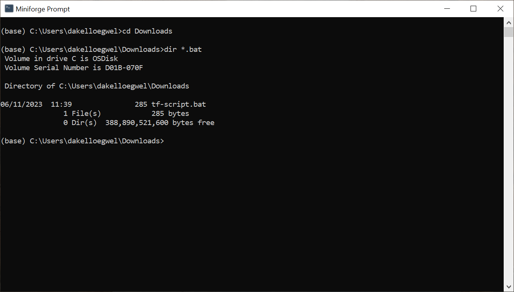
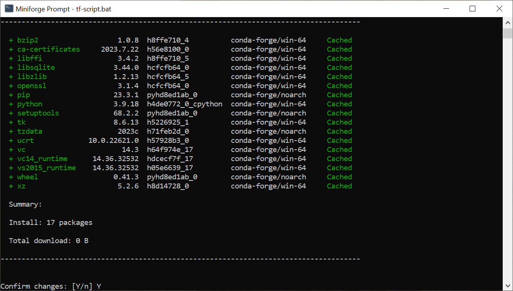
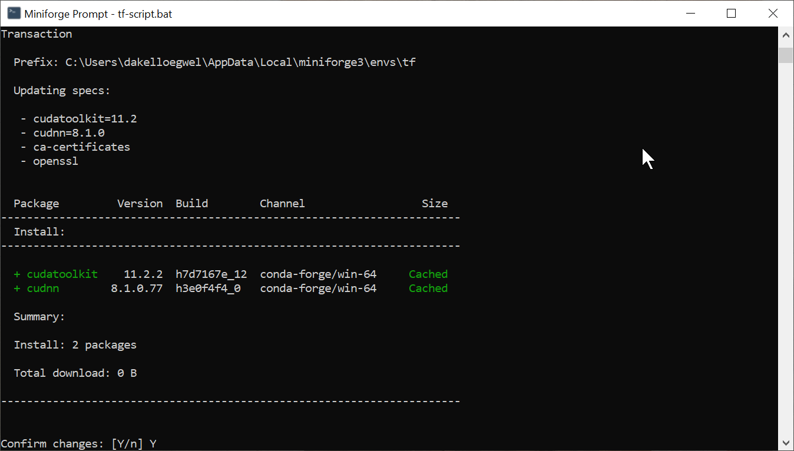
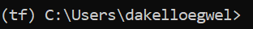
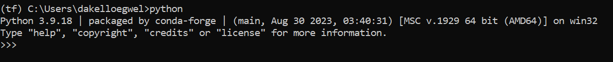
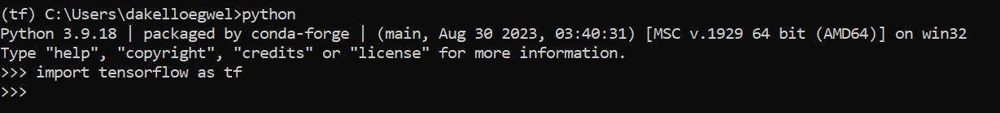
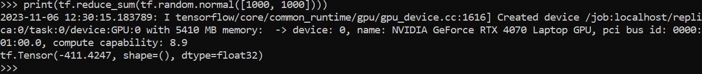
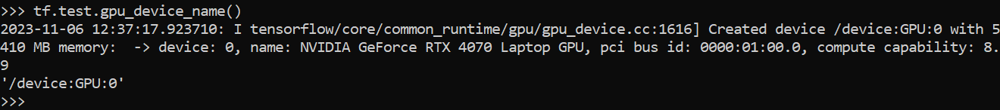

# Setting Up Tensorflow on Windows with GPU Support

## Requirements

- A Conda/Mamba installation. Read this guide on how to set this up.
- A CUDA-compatible GPU. Read [here](https://www.tensorflow.org/install/pip#windows-native_1) for more information.

## Instructions

1. Create a new file with a text editor (Notepad, Atom, Sublime, etc) and copy and paste the following into it.

### Conda File

Create this file if you are using Conda:

```
CALL conda create --name tf python=3.9
CALL conda activate tf
CALL conda install -c conda-forge cudatoolkit=11.2 cudnn=8.1.0
CALL pip install --upgrade pip
CALL pip install "tensorflow<2.11"
```

### Mamba File

Create this file if you are using Mamba:

```
CALL mamba create --name tf python=3.9
CALL mamba activate tf
CALL mamba install -c conda-forge cudatoolkit=11.2 cudnn=8.1.0
CALL pip install --upgrade pip
CALL pip install "tensorflow<2.11"
```

2. Save this file as tf-script.bat
3. Open the Miniforge Prompt and use `cd` to navigate to the folder in which the tf-script.bat file has been saved. 
    - Hint: The `dir` command can be used to list the contents of a folder. Entering `dir *.bat` will list the files in your folder that have the extension .bat.



4. Run the file by entering its name in the prompt and hitting enter.
5. You will see a list of packages that will be installed and asked if you want to confirm the changes. Type 'Y' and then hit Enter.



6. After this you will be asked to confirm the installation of `cudatoolkit` and `cudnn`. These are both required for Tensorflow to use the GPU. Like before, type `Y` and hit Enter.



## Checking the Installation

Now the `tf` environment should be installed and activated. There will be some brackets on the left of your prompt with `tf` inside them. This lets us know that the `tf` environment is activated, and any Python code we use will be run from that environment.



1. Type `python` to start Python in interactive/shell mode. You should have Python 3.9.18 installed as this is the version of Python that is required if we want to use Tensorflow with GPU support enabled.



2. Type `import tensorflow as tf` to import Tensorflow.



3. Test the installation by creating a tensor. We can do this by running the following code: `print(tf.reduce_sum(tf.random.normal([1000, 1000])))`



4. Test the GPU setup by running the following code: `tf.test.gpu_device_name()`



The output lets me know that Tensorflow is able to use my Nvidia GeForce RTX 4070 Laptop GPU. 

## Optional: Renaming the Environment

Now that the environment is installed you may want to rename it. Note: This only works with Conda.

Enter the following command into the Miniforge prompt.

`conda rename -n tf new_name`